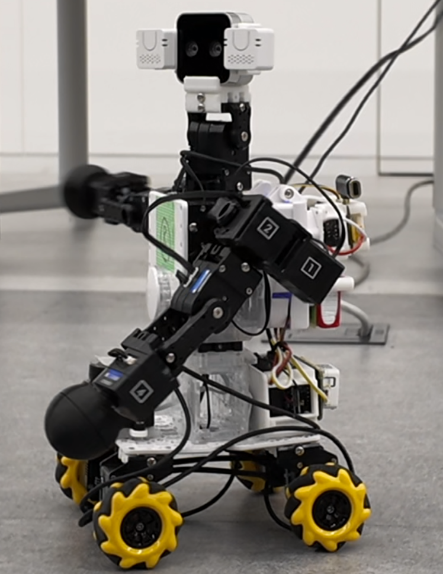

# jedy_dance

自主プロ作品

卓上双腕移動台車ロボットjedyに、指定した曲に合わせてダンスをさせるためのシステムです。

アルゴリズムの概略：

1. 楽曲ファイルを読み込む
2. 【音楽解析】楽曲の歌詞によるネガポジ判定、ビートの時刻位置推定、曲調（滑らかさ）の定量化を行う
3. 【振付生成】2に基づいて、楽曲に合ったダンスの振り付けを生成
4. 【リアルタイム制御】楽曲の再生状況に応じた（再生/一時停止、10秒送り戻しにも対応した）関節角度指令をロボットに送る

音楽解析用に作成したコードはこちらから参照可能

//spleeterを使用した音源分離
https://colab.research.google.com/drive/18nodO3Cg6QCma0GafrH48j50DRP3K6DE?usp=sharing

//librosaを使用したビート抽出
https://colab.research.google.com/drive/1a0ExqukH8umQLp9yCtuQm-l81wBqQWzz?usp=sharing

//brightness/smoothness解析
https://colab.research.google.com/drive/1CEpwTy5hbMkic0YiylBLwTE7dLgv3BoI?usp=sharing
