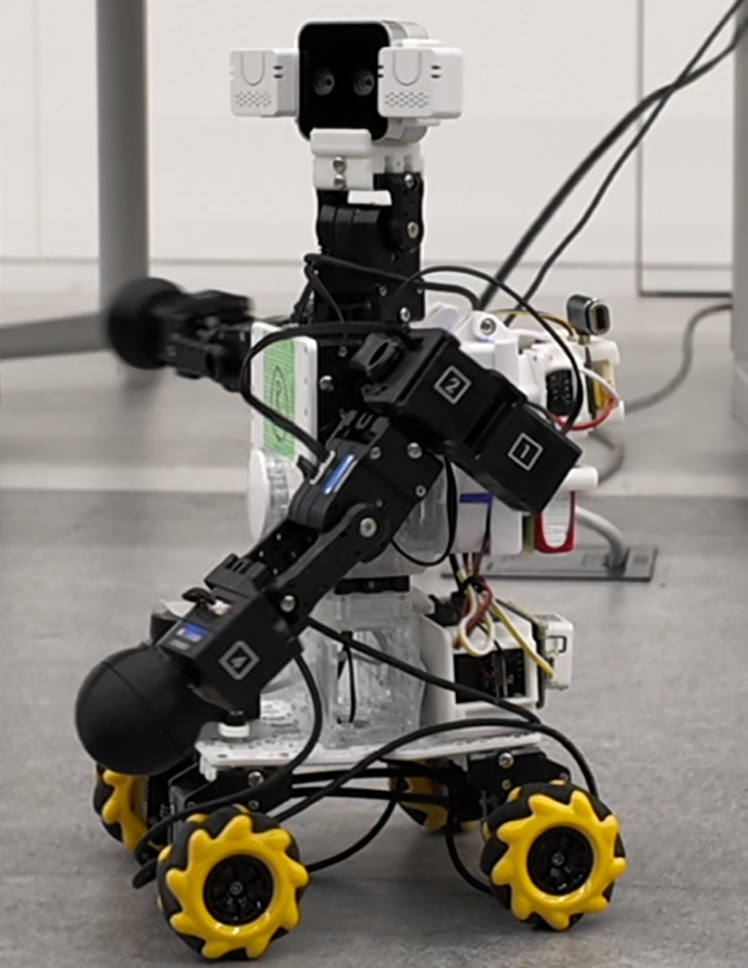

# jedy_dance


自主プロ作品

卓上双腕移動台車ロボットjedyに、指定した曲に合わせてダンスをさせるためのシステムです。

アルゴリズムの概略：

1. 楽曲ファイルを読み込む
2. 【音楽解析】楽曲の歌詞によるネガポジ判定、ビートの時刻位置推定、曲調（滑らかさ）の定量化を行う
3. 【振付生成】2に基づいて、楽曲に合ったダンスの振り付けを生成
4. 【リアルタイム制御】楽曲の再生状況に応じた（再生/一時停止、10秒送り戻しにも対応した）関節角度指令をロボットに送る


音楽解析用に作成したコードはこちらから参照可能

//spleeterを使用した音源分離
https://colab.research.google.com/drive/18nodO3Cg6QCma0GafrH48j50DRP3K6DE?usp=sharing

//librosaを使用したビート抽出
https://colab.research.google.com/drive/1a0ExqukH8umQLp9yCtuQm-l81wBqQWzz?usp=sharing

//brightness/smoothness解析
https://colab.research.google.com/drive/1CEpwTy5hbMkic0YiylBLwTE7dLgv3BoI?usp=sharing

## 環境構築

動作確認済みの環境: **Ubuntu 20.04 LTS + ROS Noetic**。以下は実際にこの構成でゼロから
セットアップして通しで動作確認した手順です。

### 1. ROS Noeticのインストール

```bash
sudo apt update
sudo apt install -y curl gnupg2 lsb-release
sudo sh -c 'echo "deb http://packages.ros.org/ros/ubuntu $(lsb_release -sc) main" > /etc/apt/sources.list.d/ros-latest.list'
curl -s https://raw.githubusercontent.com/ros/rosdistro/master/ros.asc | sudo apt-key add -
sudo apt update
sudo apt install -y ros-noetic-desktop-full python3-rosdep python3-catkin-tools
sudo rosdep init && rosdep update
echo "source /opt/ros/noetic/setup.bash" >> ~/.bashrc
source /opt/ros/noetic/setup.bash
```

### 2. システムパッケージ

```bash
sudo apt install -y python3-tk python3-pip ffmpeg vlc libvlc-dev git gnome-terminal \
  ros-noetic-ros-control ros-noetic-ros-controllers ros-noetic-gazebo-ros-control \
  ros-noetic-ridgeback-control
```

### 3. リポジトリの取得と`ros`ワークスペースの展開

このリポジトリは、ダンス制御一式（`Dancing_Jedy`本体）に加えて、必要なROSワークスペースの
ソース一式（`build`/`devel`/`logs`を除く）を`ros/`フォルダに同梱しています。

```bash
cd ~
git clone https://github.com/pontarou5/Dancing_Jedy.git Dancing_Jedy-clone
mkdir -p ~/ros
mv ~/Dancing_Jedy-clone/ros/enshu_ws ~/ros/enshu_ws
rm -rf ~/Dancing_Jedy-clone/ros
mv ~/Dancing_Jedy-clone ~/Dancing_Jedy

# mp3の絶対パス参照をこの環境に合わせて書き換え
find ~/Dancing_Jedy/analyzed_music_data -name "data_*.py" \
  -exec sed -i "s#/home/m-aoki/Dancing_Jedy#$HOME/Dancing_Jedy#g" {} +
```

### 4. ROSワークスペースのビルド

```bash
cd ~/ros/enshu_ws
rosdep install --from-paths src --ignore-src -r -y
catkin_make
echo "source ~/ros/enshu_ws/devel/setup.bash" >> ~/.bashrc
source ~/ros/enshu_ws/devel/setup.bash
rospack find jedy_bringup   # 見つかればOK
```

### 5. Pythonライブラリのインストール

依存関係の全体は`requirements.txt`にまとめていますが、**`pip install -r requirements.txt`を
一括実行すると、pipの依存解決がtensorflow(spleeter経由)とtorch/pyOpenSSL/librosaの
`typing-extensions`要求で衝突し失敗することを確認しています**。そのため、実際に動作確認できた
以下の順序でグループごとにインストールしてください。

```bash
cd ~/Dancing_Jedy
python3 -m pip install --user --upgrade pip

# 1. ビート検出・音声処理
python3 -m pip install --user pydub SpeechRecognition librosa

# 2. PyTorch (CPU版)
python3 -m pip install --user torch torchvision torchaudio --index-url https://download.pytorch.org/whl/cpu

# 3. 歌詞の明るさ(brightness)分析用
python3 -m pip install --user transformers fugashi unidic_lite sentencepiece ipadic

# 4. 音源分離 (spleeter, TensorFlowが付随してインストールされる)
python3 -m pip install --user spleeter

# 5. システムの古いh5py/pyOpenSSLがspleeterの依存(numpy/cryptography)と衝突するため上書き
#    (numpy.typeDict / X509_V_FLAG_NOTIFY_POLICY 関連のエラーが出る場合はこれが原因)
python3 -m pip install --user --upgrade h5py
python3 -m pip install --user --upgrade pyopenssl

# 6. 音楽再生・GUI操作用
python3 -m pip install --user python-vlc pynput
```

`music_analysis.py`/`dance_generation.py`（新しい曲の追加）を使わず、既存曲でダンスさせる
だけなら、手順5は不要です（`music_publish.py`用のpython-vlc・pynputだけあれば足ります）。

### 6. 動作確認

```bash
cd ~/Dancing_Jedy
python3 gui_dancing_jedy_sim.py   # シミュレーション(Gazebo)版
# python3 gui_dancing_jedy_real.py  # 実機版
```

## Ubuntu 20.04以外の環境で動かす方法

ROS Noeticは公式にはUbuntu 20.04 (Focal) 専用です。それ以外のOS・ディストリビューションで
動かす場合は、以下のいずれかの方法を取ってください。

### 方法A: Docker（推奨）

ホストOSに関係なく、コンテナ内はUbuntu 20.04として動くため最も確実です。Gazebo・GUIを
表示するにはホストのXサーバーへ接続する設定が必要です。

```bash
# ホスト側（Ubuntu 22.04/24.04など）
xhost +local:docker

docker run -it --net=host \
  -e DISPLAY=$DISPLAY \
  -v /tmp/.X11-unix:/tmp/.X11-unix \
  -v ~/Dancing_Jedy:/root/Dancing_Jedy \
  osrf/ros:noetic-desktop-full bash
```

コンテナ内で上記「環境構築」の手順2以降（ROS自体は既にイメージに含まれるので手順1は不要）を
そのまま実行してください。GPUで音声認識/機械学習を高速化したい場合は`--gpus all`を追加し、
CUDA対応のPyTorchイメージを使ってください（このプロジェクトはCPU版PyTorchで動作確認済み）。

macOSの場合はDocker Desktop + [XQuartz](https://www.xquartz.org/)、WindowsはWSL2 + Docker
Desktop（WSLgでX11転送が自動対応）で同様の手順が使えます。

### 方法B: 仮想マシン

VirtualBox/VMware等でUbuntu 20.04のVMを作成し、その中で「環境構築」の手順をそのまま実行する
方法です。Dockerより準備は簡単ですが、Gazeboの3D描画がVM内だと重くなりがちな点に注意してくだ
さい（VirtualBoxなら3Dアクセラレーションを有効化、VMwareならGPU passthroughを検討）。

### 方法C: RoboStack (conda/mamba)

Ubuntu 20.04以外のOS上に、conda環境としてROS Noeticそのものをインストールする方法です
（Linux/macOS/Windows対応、Dockerより軽量）。

```bash
conda create -n ros_env python=3.8
conda activate ros_env
conda install -c conda-forge -c robostack-staging ros-noetic-desktop
```

その後、`rosdep`/`catkin build`等のコマンド名がRoboStack環境では若干異なる場合があるので、
[RoboStack公式ドキュメント](https://robostack.github.io/)を参照しつつ、上記「環境構築」の
手順3以降（`apt`によるROS本体インストール部分を除く）を進めてください。ただし本プロジェクトは
Ubuntu 20.04 + ROS Noeticでのみ動作確認をしており、RoboStack環境での動作は未検証です。
